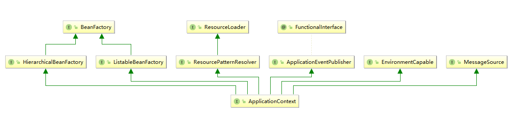

# Spring源码记录

## 一、BeanFactory和ApplicationContext

Spring框架最核心的功能为IOC，我们一般称BeanFactory为Spring的IOC容器，而ApplicationContext是BeanFactory的子接口，他组合了BeanFactory拥有其全部功能，并且扩展了更多面向实际应用的、企业级的高级特性。例如下图中可以看出除了BeanFactory之外ApplicationContext还继承了其他接口。



> 思绪记录：
>
> ​	控制反转(Inversion of control)即由Spring帮我们实例化需要的对象。那么我们需要给Spring提供这些对象元数据这样Spring才能在我们需要的时候为我们实例化对象——即我们通过XML或者注解配置bean，在需要使用的地方通过注解Autowired或Resource。这其中读取对象元数据到实例化对象这个过程就是由Spring IOC提供的。
>
> ​	最核心的IOC容器为DefaultListableBeanFactory，他是BeanFactory接口最重要的一个实现类，提供了IOC容器最基础的功能。
>
> ​	Spring中使用BeanDefinition来保存对象的元数据，将通过BeanDefinition实例化生成的对象叫做Bean。而实例化Bean是DefaultListableBeanFactory完成的，ApplicationContext的实现类都包含一个DefaultListableBeanFactory的成员变量，通过调用它的方法来实现IOC容器的基础功能。

## 二、DefaultListableBeanFactory

接口[`ConfigurableListableBeanFactory`](https://docs.spring.io/spring-framework/docs/current/javadoc-api/org/springframework/beans/factory/config/ConfigurableListableBeanFactory.html) 和[`BeanDefinitionRegistry`](https://docs.spring.io/spring-framework/docs/current/javadoc-api/org/springframework/beans/factory/support/BeanDefinitionRegistry.html)的默认实现。基于 bean 定义元数据的成熟 bean 工厂，可通过后处理器扩展。其类图如下所示：


> 思绪记录：
>
> ​	看Spring中核心程序的类图可以发现，都直接或间接的继承和实现了很多类和接口。这其实就是Spring源码做的很好的地方——接口应该具备单一职责。相比于Spring源码里面的API和设计模式，很多人都会忽略这些最基础的内容。所以说要研究一个核心类，最好先了解其实现的接口的作用。

### 2.1 BeanDefinitionRegistry

**`BeanDefinitionRegistry`**接口类定义如下，它继承了接口**`AliasRegistry`**，所以它同样具有**`AliasRegistry`**的功能。

```java
public interface BeanDefinitionRegistry extends AliasRegistry {
	......
}
```

**`AliasRegistry`**接口源码如下，该接口的作用管理Bean的别名。它的实现类为**`SimpleAliasRegistry`**，Spring对Bean别名的操作都是通过**`SimpleAliasRegistry`**操作的。

```java
public interface AliasRegistry {

	void registerAlias(String name, String alias);

	void removeAlias(String alias);

	boolean isAlias(String name);

	String[] getAliases(String name);

}
```

**`BeanDefinitionRegistry`**接口源码如下，该接口主要作用是管理Bean的定义信息（BeanDefinition）。它的实现类就是**`DefaultListableBeanFactory`**。Spring中对**`BeanDefinition`**的操作都是通过**`DefaultListableBeanFactory`**。例如上文说过的**`ApplicationContext`**各种实现类。

```java
public interface BeanDefinitionRegistry extends AliasRegistry {

    //将bean定义信息注册到IOC容器
	void registerBeanDefinition(String beanName, BeanDefinition beanDefinition)
			throws BeanDefinitionStoreException;

    //删除bean的定义信息
	void removeBeanDefinition(String beanName) throws NoSuchBeanDefinitionException;

    //获取bean的定义信息
	BeanDefinition getBeanDefinition(String beanName) throws NoSuchBeanDefinitionException;

	boolean containsBeanDefinition(String beanName);

	String[] getBeanDefinitionNames();

	int getBeanDefinitionCount();

	default boolean isBeanDefinitionOverridable(String beanName) {
		return true;
	}

	boolean isBeanNameInUse(String beanName);

}
```

看过这两个接口的源码之后，就清楚了**`BeanDefinitionRegistry`**接口的作用：管理Bean的别名和定义信息。

### 2.2 ConfigurableListableBeanFactory

查看上文类图，发现其继承的接口很多，其父接口说明如下。

#### 2.2.1 BeanFactory

**`BeanFactory`**是访问Spring容器最核心的接口。他最主要的作用为获取容器中的Bean。

```java
public interface BeanFactory {

	String FACTORY_BEAN_PREFIX = "&";
	Object getBean(String name) throws BeansException;
	<T> T getBean(String name, Class<T> requiredType) throws BeansException;
	Object getBean(String name, Object... args) throws BeansException;
	<T> T getBean(Class<T> requiredType) throws BeansException;
	<T> T getBean(Class<T> requiredType, Object... args) throws BeansException;
	<T> ObjectProvider<T> getBeanProvider(Class<T> requiredType);
	<T> ObjectProvider<T> getBeanProvider(ResolvableType requiredType);
	boolean containsBean(String name);
	boolean isSingleton(String name) throws NoSuchBeanDefinitionException;
	boolean isPrototype(String name) throws NoSuchBeanDefinitionException;
	boolean isTypeMatch(String name, ResolvableType typeToMatch) throws NoSuchBeanDefinitionException;
	boolean isTypeMatch(String name, Class<?> typeToMatch) throws NoSuchBeanDefinitionException;
	@Nullable
	Class<?> getType(String name) throws NoSuchBeanDefinitionException;
	@Nullable
	Class<?> getType(String name, boolean allowFactoryBeanInit) throws NoSuchBeanDefinitionException;
	String[] getAliases(String name);
}
```

#### 2.2.2 SingletonBeanRegistry

该接口用于将已经完全实例化的单例的Bean注册到IOC容器中，它的实现类是**`DefaultSingletonBeanRegistry`**。

```java
public interface SingletonBeanRegistry {

	void registerSingleton(String beanName, Object singletonObject);

	@Nullable
	Object getSingleton(String beanName);

	boolean containsSingleton(String beanName);

	String[] getSingletonNames();

	int getSingletonCount();

	Object getSingletonMutex();
}
```

注意与上文**`BeanDefinitionRegistry`**做好区分，区别如下所示：

| 接口                   | 实现类                       | 作用                                        |
| :--------------------- | ---------------------------- | ------------------------------------------- |
| SingletonBeanRegistry  | DefaultSingletonBeanRegistry | 将已经完全实例化的单例的Bean注册到IOC容器中 |
| BeanDefinitionRegistry | DefaultListableBeanFactory   | 将bean定义信息注册到IOC容器中               |

> 思绪记录
>
> ​	文章中记录的IOC容器是一个抽象的概念，它是Spirng中保存所有bean信息的集合，我们将这些集合统称为IOC容器或者Spring容器。 实际上**DefaultSingletonBeanRegistry**和**DefaultListableBeanFactory**都有一个类型为**ConcurrentHashMap**的成员变量，分别为`Map<String, BeanDefinition> beanDefinitionMap`和`Map<String, Object> singletonObjects`。**beanDefinitionMap**用于保存bean的定义信息，**singletonObjects**用于保存已经实例化的bean。

#### 2.2.3 ListableBeanFactory

该接口继承了**`BeanFactory`**，在其功能的基础上，新增枚举bean实例的功能。

> NOTE: With the exception of getBeanDefinitionCount and containsBeanDefinition, the methods in this interface are not designed for frequent invocation. Implementations may be slow.

需要注意的是，该接口中除了`getBeanDefinitionCount` 和 `containsBeanDefinition`，其他方法不适合频繁调用。执行会比较慢。

```java
public interface ListableBeanFactory extends BeanFactory {
	boolean containsBeanDefinition(String beanName);
	int getBeanDefinitionCount();
	String[] getBeanDefinitionNames();
	<T> ObjectProvider<T> getBeanProvider(Class<T> requiredType, boolean allowEagerInit);
	<T> ObjectProvider<T> getBeanProvider(ResolvableType requiredType, boolean allowEagerInit);
	String[] getBeanNamesForType(ResolvableType type);
	String[] getBeanNamesForType(ResolvableType type, boolean includeNonSingletons, boolean allowEagerInit);
	String[] getBeanNamesForType(@Nullable Class<?> type);
	String[] getBeanNamesForType(@Nullable Class<?> type, boolean includeNonSingletons, boolean allowEagerInit);
	<T> Map<String, T> getBeansOfType(@Nullable Class<T> type) throws BeansException;
	<T> Map<String, T> getBeansOfType(@Nullable Class<T> type, boolean includeNonSingletons, boolean allowEagerInit)
			throws BeansException;
	String[] getBeanNamesForAnnotation(Class<? extends Annotation> annotationType);
	Map<String, Object> getBeansWithAnnotation(Class<? extends Annotation> annotationType) throws BeansException;
	@Nullable
	<A extends Annotation> A findAnnotationOnBean(String beanName, Class<A> annotationType)
			throws NoSuchBeanDefinitionException;
	@Nullable
	<A extends Annotation> A findAnnotationOnBean(
			String beanName, Class<A> annotationType, boolean allowFactoryBeanInit)
			throws NoSuchBeanDefinitionException;
	<A extends Annotation> Set<A> findAllAnnotationsOnBean(
			String beanName, Class<A> annotationType, boolean allowFactoryBeanInit)
			throws NoSuchBeanDefinitionException;
}
```

#### 2.2.4 HierarchicalBeanFactory

**`HierarchicalBeanFactory`** 在**`BeanFactory`**基础上，新增提供父子容器的层次关系查找能力。

至于父容器的设置，需要通过**`ConfigurableBeanFactory#setParentBeanFactory`**

> 至于为啥要将设置和查询拆开，看不太明白。

其源码如下：

```java
public interface HierarchicalBeanFactory extends BeanFactory {
	@Nullable
	BeanFactory getParentBeanFactory();

	boolean containsLocalBean(String name);
}
```

#### 2.2.5 ConfigurableBeanFactory

**`ConfigurableBeanFactory`**接口定义如下：

```java
public interface ConfigurableBeanFactory extends HierarchicalBeanFactory, SingletonBeanRegistry {
    ......
}
```

该接口继承了**`HierarchicalBeanFactory`**和**`SingletonBeanRegistry`**。所以其具备查询bean实例（来自**BeanFactory**）、查询父容器（来自**HierarchicalBeanFactory**）和注册已实例化的bean到容器（来自**SingletonBeanRegistry**）的能力，**`ConfigurableBeanFactory`**接口在此之外新提供了很多配置 bean 工厂的工具。


**`ConfigurableBeanFactory`**接口不适合在正常应用程序代码中使用——应使用 `**BeanFactory**` 或 **`org.springframework.beans.factory.ListableBeanFactory`** 。 这个扩展接口只是为了允许框架内部即插即用以及对 bean 工厂配置方法的特殊访问。


**`ConfigurableBeanFactory`**接口源码较多不便在文章中展示，其接口文档地址如下：[ConfigurableBeanFactory](https://docs.spring.io/spring-framework/docs/current/javadoc-api/org/springframework/beans/factory/config/ConfigurableBeanFactory.html)

#### 2.2.6 AutowireCapableBeanFactory

该接口在**`BeanFactory`**的基础上新提供了自动装配功能，可以将IOC容器中已经实例化的bean，注入到不在IOC容器中的普通对象。该接口是实现类为**`AbstractAutowireCapableBeanFactory`**，主要用于与第三方框架整合。

```java
public interface AutowireCapableBeanFactory extends BeanFactory {

	int AUTOWIRE_NO = 0;
	int AUTOWIRE_BY_NAME = 1;
	int AUTOWIRE_BY_TYPE = 2;
	int AUTOWIRE_CONSTRUCTOR = 3;
	@Deprecated
	int AUTOWIRE_AUTODETECT = 4;

	String ORIGINAL_INSTANCE_SUFFIX = ".ORIGINAL";
    //实例化bean,过程中会自动注入需要的属性。
	<T> T createBean(Class<T> beanClass) throws BeansException;
    //自动注入bean中属性，如果IOC容器中存在
	void autowireBean(Object existingBean) throws BeansException;

	Object configureBean(Object existingBean, String beanName) throws BeansException;

	Object autowire(Class<?> beanClass, int autowireMode, boolean dependencyCheck) throws BeansException;

	void autowireBeanProperties(Object existingBean, int autowireMode, boolean dependencyCheck)
			throws BeansException;

	void applyBeanPropertyValues(Object existingBean, String beanName) throws BeansException;

	Object initializeBean(Object existingBean, String beanName) throws BeansException;

	void destroyBean(Object existingBean);

	<T> NamedBeanHolder<T> resolveNamedBean(Class<T> requiredType) throws BeansException;

	Object resolveBeanByName(String name, DependencyDescriptor descriptor) throws BeansException;

	@Nullable
	Object resolveDependency(DependencyDescriptor descriptor, @Nullable String requestingBeanName) throws BeansException;

	@Nullable
	Object resolveDependency(DependencyDescriptor descriptor, @Nullable String requestingBeanName,
			@Nullable Set<String> autowiredBeanNames, @Nullable TypeConverter typeConverter) throws BeansException;

}
```

### 2.3 使用示例


